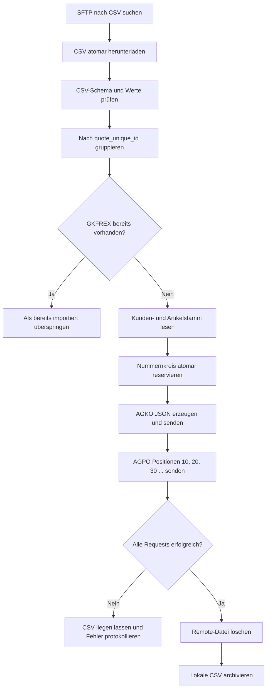

# Angebotserstellung aus CSV → IBM i AGKO/AGPO

## Ziel und Abgrenzung

Dieses Projekt dient ausschließlich der **Angebotserstellung** in Trend-ERP.

Die Lösung liest semikolongetrennte CSV-Dateien, gruppiert alle Zeilen nach `quote_unique_id` und erzeugt je Gruppe:

- einen Angebotskopf in `AGKO`,
- fortlaufende Angebotspositionen in `AGPO`,
- eine eindeutige Trend-Angebotsnummer aus einem Nummernkreis,
- JSON-Protokolle für jeden API-Request,
- ein technisches Ablaufprotokoll.

Die Skripte sind standardmäßig sicher konfiguriert: Ohne den Parameter `-Execute` erfolgen keine Schreibzugriffe.

## Dateien

| Datei | Aufgabe |
|---|---|
| `QuoteImport.Common.psm1` | Logging, Konvertierung, Validierung, API-Aufrufe, Stammdaten, Nummernkreis und AGKO/AGPO-Mapping |
| `QuoteImport.Sftp.psm1` | SFTP-Verbindung, Download und spätere Remote-Löschung |
| `QuoteImport.config.psd1` | Zentrale Konfiguration |
| `Process-AllQuoteCsv.ps1` | Vollständiger Batch-Prozess: Download, Import, Remote-Löschung, Archivierung |
| `Send-QuoteCsv.ps1` | Test oder Import einer einzelnen CSV-Datei |
| `Download-QuoteCsvFromSftp.ps1` | Manueller Download; löscht absichtlich noch nichts auf dem SFTP |
| `sample-quotes.csv` | Testdatei mit der vorgegebenen Struktur |

## Ablauf



## CSV-Struktur

```text
quote_unique_id;quote_number;customer_number;article_number;quantity;quote_date;delivery_company_name1;delivery_company_name2;delivery_company_name3;delivery_address;delivery_address_misc;delivery_zip_code;delivery_city;delivery_country;delivery_email;delivery_phone;field_sales_id;reference_2;valid_from;valid_to;discount;gross_unit_price;net_unit_price
```

Mehrere Positionen desselben Angebots müssen dieselbe `quote_unique_id` besitzen. Die Kopfwerte innerhalb dieser Gruppe müssen konsistent sein.

## Zentrales Mapping

### AGKO

| CSV/Quelle | AGKO | Logik |
|---|---|---|
| Konfiguration | `GKFIRM` | Standard `01` |
| Konfiguration | `GKAGAR` | Standard `150` |
| Nummernkreis | `GKAGJJ` | Angebotsjahr |
| Nummernkreis | `GKAGNN` | numerische Angebotsnummer |
| Nummernkreis | `GKAGNR` | sechsstellig formatiert |
| `customer_number` | `GKKDNR` | numerisch mindestens sechsstellig, maximal zehn Zeichen |
| `field_sales_id` oder Default | `GKSABE` | maximal drei Zeichen; bei längerem Wert wird Default verwendet |
| Konfiguration | `GKWKNR`, `GKABTL`, `GKABAR`, `GKAGST` | feste Werte |
| Kundenstamm/Fallback | `GKWACD`, `GKVSBD`, `GKLIBD`, `GKZABD`, `GKSPCD` | Aliaswerte aus SQL-Template |
| `valid_from` | `GKGADA` | `yyyyMMdd` |
| `valid_to` | `GKGBDA` | `yyyyMMdd` |
| `quote_date` | `GKAGDA` | `yyyyMMdd` |
| `quote_number` | `GKARF1` | optionale Referenz 1 |
| `reference_2` | `GKARF2` | optionale Referenz 2 |
| `quote_unique_id` | `GKFREX` | technischer Idempotenzschlüssel |

### AGPO

| CSV/Quelle | AGPO | Logik |
|---|---|---|
| AGKO | `GPFIRM`, `GPKDNR`, `GPAGJJ`, `GPAGNR`, `GPAGAR`, `GPWKNR`, `GPABTL`, `GPSABE`, `GPABAR`, `GPWACD`, `GPAGST`, `GPGADA`, `GPGBDA` | aus Kopf übernommen |
| Position | `GPAGPO` | 10, 20, 30, ... |
| `article_number` | `GPTENR` | maximal 15 Zeichen |
| `quantity` | `GPMENG` | Dezimalwert größer 0 |
| Artikelstamm/Fallback | `GPTBZ1`, `GPTBZ2`, `GPMEIN`, `GPMEPR` | Aliaswerte aus SQL-Template |
| Berechnung | `GPWAWT` | Menge × Brutto-Einzelpreis |
| Konfiguration | `GPPRAR` | Standard `AKD` |
| `gross_unit_price` | `GPPREI` | Brutto-Einzelpreis; ersatzweise Netto |
| Berechnung | `GPNESU` | Menge × Netto-Einzelpreis |
| Konfiguration | `GPPDIM` | Standard `1` |
| Konfiguration | `GPKON1` | Standard `RA5` |
| `discount` | `GPKOW1` | 0 bis 100 |
| Konfiguration | `GPPRZ1` | Standard `J` |
| `quote_date` | `GPAGDA` | aus Kopf |
| `gross_unit_price` | `GPURPR` | Ursprungspreis |

## Nicht automatisch gemappte CSV-Felder

Die bereitgestellte AGKO-/AGPO-Feldliste enthält keine eindeutig zugeordneten Felder für die abweichende Lieferadresse, E-Mail und Telefonnummer. Die Spalten werden eingelesen und bleiben in der CSV erhalten, aber nicht in AGKO/AGPO geschrieben. Falls Trend dafür eine zusätzliche Adress- oder Texttabelle nutzt, muss diese als weiterer Importbaustein ergänzt werden.

## Nummernkreis: zwingender Produktionspunkt

Ein Nummernkreis darf nicht über folgende Logik erzeugt werden:

```sql
SELECT MAX(GKAGNN) + 1 ...
```

Zwei gleichzeitig laufende Prozesse könnten denselben Wert erhalten. Für Produktion muss `NumberRange.Mode = 'Api'` gesetzt und `NumberRange.Url` mit einem Endpunkt belegt werden, der die Nummer serverseitig atomar reserviert.

Erwarteter Request des gelieferten Skripts:

```json
{
  "company": "01",
  "documentType": "150",
  "year": 2026,
  "externalReference": "63a6c522",
  "testMode": true
}
```

Unterstützte Antwortfelder:

```json
{
  "year": 2026,
  "number": 103015
}
```

Alternativ werden `documentYear`, `documentNumber`, `nextNumber`, `GKAGJJ` und `GKAGNN` erkannt. Die Werte dürfen direkt oder unter `data` stehen.

## Kunden- und Artikelstamm

In `QuoteImport.config.psd1` müssen die echten Tabellen und Felder ergänzt werden.

Der Kunden-Query muss folgende Aliase liefern:

```sql
CURRENCY_CODE,
SHIPPING_CONDITION,
DELIVERY_CONDITION,
PAYMENT_CONDITION,
LANGUAGE_CODE
```

Der Artikel-Query muss folgende Aliase liefern:

```sql
DESCRIPTION1,
DESCRIPTION2,
QUANTITY_UNIT,
PRICE_UNIT
```

Vor Produktion:

```powershell
MasterData.Strict = $true
```

Damit wird ein Import abgebrochen, wenn Kunde oder Artikel nicht gefunden werden.

## Secrets anlegen

### API-Token

```powershell
New-Item 'D:\Quotation\QuoteImport\secure' -ItemType Directory -Force

Read-Host 'API Bearer Token' -AsSecureString |
    ConvertFrom-SecureString |
    Set-Content 'D:\Quotation\QuoteImport\secure\api-token.sec'
```

### SFTP-Passwort

```powershell
Read-Host 'SFTP Password' -AsSecureString |
    ConvertFrom-SecureString |
    Set-Content 'D:\Quotation\QuoteImport\secure\sftp-password.sec'
```

Ohne zusätzlichen Schlüssel sind diese Dateien an Windows-Benutzer und Rechner gebunden. Ein geplanter Task muss unter demselben Benutzerkonto ausgeführt werden.

## SSH-Host-Key

`Sftp.SshHostKeyFingerprint` muss mit dem echten Fingerprint belegt werden. `AllowInsecureHostKey = $true` ist nur für einen kurzfristigen Verbindungstest vorgesehen und sollte nicht produktiv verwendet werden.

## Getrennte API-Endpunkte

Für lesende SQL-Abfragen wird die bestätigte vollständige URL verwendet:

```powershell
SelectUrl = 'http://az16emsapp01.dometic.internal:8085/api/services/AGKO/select'
```

Der Schreibendpunkt ist davon unabhängig konfigurierbar:

```powershell
AddUrl = ''
```

Ist `AddUrl` leer, verwendet das Modul weiterhin:

```text
BaseUrl + /add
```

Mit der aktuellen Konfiguration ist das:

```text
http://localhost:8085/api/ibmi/s105dd7a/add
```

Der Add-Endpunkt wurde bewusst nicht automatisch geändert, weil bislang nur die
korrekte SELECT-URL bestätigt wurde.

Beim Start protokolliert das Skript beide tatsächlich verwendeten Endpunkte auf
DEBUG-Ebene.

## Tests

### 1. Einzeldatei als DryRun

```powershell
Set-Location D:\Quotation\QuoteImport

.\Send-QuoteCsv.ps1 `
    -CsvPath '.\sample-quotes.csv'
```

Ergebnis:

- CSV wird validiert,
- feste Testnummer wird verwendet,
- JSON-Dateien entstehen im Dump-Verzeichnis,
- keine API-Schreibzugriffe erfolgen.

### 2. Schreiben ins Testsystem

Voraussetzungen:

- `Api.HeaderTable = 'TVPFTEST.AGKO'`
- `Api.PositionTable = 'TVPFTEST.AGPO'`
- `Api.TestMode = $true`
- korrekter API-Token

```powershell
.\Send-QuoteCsv.ps1 `
    -CsvPath '.\sample-quotes.csv' `
    -Execute
```

### 3. Vollständiger Batch-DryRun

```powershell
.\Process-AllQuoteCsv.ps1
```

### 4. Vollständiger Testimport

```powershell
.\Process-AllQuoteCsv.ps1 -Execute
```

## Produktionsfreigabe

Vor einem Produktivlauf müssen mindestens folgende Punkte erledigt sein:

1. Echte Kunden- und Artikelstamm-Queries eintragen.
2. `MasterData.Strict = $true` setzen.
3. Atomaren Nummernkreis-Endpunkt konfigurieren.
4. Tabellen auf `TVPF.AGKO` und `TVPF.AGPO` umstellen.
5. Bedeutung von `testMode` der API verifizieren.
6. SFTP-Fingerprint eintragen.
7. API- und SFTP-Secrets unter dem Task-Benutzer erzeugen.
8. Prüfen, ob die API Kopf und Positionen transaktional schreiben oder einen Rollback anbieten kann.
9. Lieferadressdaten fachlich einer Trend-Tabelle oder Schnittstelle zuordnen.
10. Einen vollständigen Test inklusive Trend-Folgeprozess durchführen.

## Teilimport und Wiederholung

Die API-Aufrufe für AGKO und AGPO sind einzelne HTTP-Requests. Schlägt eine Position nach erfolgreichem Kopf fehl, bleibt die CSV im Eingangsverzeichnis und der Fehler wird protokolliert. `quote_unique_id` wird in `GKFREX` gespeichert und vor jedem Import geprüft.

Für eine vollständig automatische Wiederaufnahme eines Teilimports wäre zusätzlich eine der folgenden API-Funktionen notwendig:

- serverseitige Transaktion für Kopf und alle Positionen,
- Rollback/Delete eines unvollständigen Angebots,
- Resume-Logik, die vorhandene AGPO-Positionen exakt prüft und ergänzt.

Ohne eine bestätigte fachliche Vorgabe implementiert die Lösung bewusst kein automatisches Löschen vorhandener Trend-Daten.

## Windows PowerShell 5.1

Die Startskripte verwenden `$PSScriptRoot` nicht mehr als Standardwert direkt
im `param`-Block. In manchen Windows-PowerShell-5.1-Umgebungen ist die Variable
während der Parameterbindung noch leer. Das Skriptverzeichnis wird deshalb erst
nach dem `param`-Block ermittelt. Als Fallback wird `$PSCommandPath` verwendet.

## Korrektes AGKO-Select-Protokoll

Der bestätigte Endpunkt lautet:

```text
http://az16emsapp01.dometic.internal:8085/api/services/AGKO_select
```

Der Service wird per **HTTP GET** aufgerufen. Filter stehen in der URL:

```text
http://az16emsapp01.dometic.internal:8085/api/services/AGKO_select?GKAGJJ=2026&GKAGNR=100004
```

Die Antwort besitzt das Format:

```json
{
  "success": true,
  "data": [
    {
      "GKAGJJ": "2026",
      "GKAGNR": "100004"
    }
  ]
}
```

Für die Duplikatprüfung des Imports wird folgender Aufruf erzeugt:

```text
http://az16emsapp01.dometic.internal:8085/api/services/AGKO_select?GKFIRM=01&GKFREX=<quote_unique_id>
```

Damit dies funktioniert, muss `AGKO_select` das Feld `GKFREX` als Filter
unterstützen. Ist das nicht der Fall, wird ein eigener bestätigter Lookup-Service
für die externe ID benötigt.

Direkter Test:

```powershell
.\Test-AGKOSelect.ps1 -Year 2026 -QuoteNumber '100004'
```

`SqlSelectUrl` ist ein separater optionaler SQL-POST-Endpunkt. Er bleibt leer,
solange keine Kunden- oder Artikelstammqueries konfiguriert sind.

## Bearer-Token interaktiv eingeben

Für einen manuellen Lauf kann der API-Bearer-Token verdeckt abgefragt werden.

### Gesamten Import starten

Dry-Run mit sicherer Token-Eingabe:

```powershell
.\Process-AllQuoteCsv.ps1 -PromptForBearerToken
```

Echter Testsystem-Schreibzugriff mit sicherer Token-Eingabe:

```powershell
.\Process-AllQuoteCsv.ps1 `
    -Execute `
    -PromptForBearerToken
```

### Einzelne CSV-Datei testen

```powershell
.\Send-QuoteCsv.ps1 `
    -CsvPath 'D:\Quotation\QuoteImport\incoming\sample-quotes.csv' `
    -PromptForBearerToken
```

### AGKO-Select direkt testen

```powershell
.\Test-AGKOSelect.ps1 `
    -Year 2026 `
    -QuoteNumber '100004' `
    -PromptForBearerToken
```

Die Eingabe erfolgt über:

```powershell
Read-Host -AsSecureString
```

Der Token:

- wird bei der Eingabe nicht angezeigt,
- wird nicht in das technische Log geschrieben,
- wird nicht automatisch gespeichert,
- gilt nur für den aktuellen PowerShell-Prozess.

Für eine dauerhafte interaktive Abfrage kann in `QuoteImport.config.psd1`
Folgendes gesetzt werden:

```powershell
PromptForBearerToken = $true
```

Für einen unbeaufsichtigten Windows-Task muss der Wert auf `$false` bleiben.
Der Task verwendet stattdessen `BearerTokenFile`.

Ein Token sollte nicht als Klartext-Parameter an der Kommandozeile übergeben
werden, da er sonst in der PowerShell-Historie oder in Prozessinformationen
sichtbar werden kann.

## Korrektur der Duplikatprüfung

Der bestätigte Endpoint `AGKO_select` unterstützt ausschließlich die Parameter:

```text
GKAGJJ
GKAGNR
```

Ein Aufruf mit `GKFIRM` und `GKFREX` führt im Backend zu einem Parameterfehler,
weil dort intern immer diese SQL-Bedingung vorbereitet wird:

```sql
WHERE GKAGJJ = :GKAGJJ
  AND GKAGNR = :GKAGNR
```

Die Anwendung arbeitet deshalb ab Version 7 wie folgt:

1. Optionaler separater `ExternalReferenceSelectUrl` für `GKFREX`.
2. Wenn dieser leer ist, wird keine externe-ID-Prüfung ausgeführt.
3. Die Angebotsnummer wird reserviert beziehungsweise im Testmodus festgelegt.
4. Danach erfolgt die bestätigte Prüfung:

```text
AGKO_select?GKAGJJ=<Jahr>&GKAGNR=<sechsstellige Nummer>
```

5. Existiert die Nummer bereits:
   - bei passender, nicht leerer `GKFREX` wird das Angebot übersprungen,
   - bei leerer oder abweichender `GKFREX` wird wegen Nummernkollision abgebrochen.

Damit wird verhindert, dass eine bereits vorhandene AGKO-Nummer überschrieben
oder nochmals angelegt wird. Eine vollständige Idempotenz über
`quote_unique_id` ist erst möglich, wenn ein separater Service die Suche nach
`GKFREX` ausdrücklich unterstützt.

## Korrektur v8: leeres `data[]` ist kein Treffer

Eine erfolgreiche API-Antwort ohne Datensatz sieht beispielsweise so aus:

```json
{
  "success": true,
  "data": []
}
```

Unter Windows PowerShell 5.1 wurde das leere Array zuvor aufgrund einer
Vergleichsbesonderheit nicht korrekt erkannt. Die komplette Antwort-Hülle wurde
dadurch fälschlich als AGKO-Zeile gewertet.

Version 8:

- erkennt ein vorhandenes, aber leeres `data`-Array ausdrücklich,
- liefert dafür exakt null Datensätze,
- protokolliert die Anzahl echter Datensätze,
- akzeptiert bei der Kollisionsprüfung nur eine Zeile mit exakt passenden
  Werten in `GKAGJJ` und `GKAGNR` beziehungsweise `GKAGNN`,
- bricht bei unerwarteten oder mehreren Antworten sicher ab.

Erwartetes Log für eine freie Nummer:

```text
GET-SELECT 'AGKO-Nummernprüfung 2026/103015': echte Datensätze in data[] = 0
AGKO-Nummernprüfung: 2026/103015 ist nicht vorhanden.
```

## Korrektur v9: API-Erfolg ist erst nach Speicherung erfolgreich

Ein fehlerfreier HTTP-POST beweist nicht, dass AGKO oder AGPO gespeichert wurde.
Die frühere Implementierung behandelte jeden HTTP-200-Aufruf als Erfolg und
archivierte anschließend die CSV.

Version 9 führt folgende Prüfungen durch:

1. Die komplette API-Antwort wird auf DEBUG-Ebene protokolliert.
2. Ein explizites `success=false` gilt als Fehler.
3. Nach dem AGKO-POST wird `AGKO_select` mit `GKAGJJ/GKAGNR` aufgerufen.
4. AGPO wird erst gesendet, wenn der Kopf wirklich in AGKO vorhanden ist.
5. Die CSV wird nur archiviert, wenn diese Nachkontrolle erfolgreich war.

Besonders zu beachten:

```powershell
TestMode = $true
```

Dieser Wert wird als `"testMode": true` an die Add-API gesendet. Je nach
API-Implementierung kann das eine reine Validierung oder Simulation ohne
Datenbank-COMMIT bedeuten.

Bei einer nicht gespeicherten Zeile erscheint künftig:

```text
AGKO-POST wurde von der API ohne HTTP-Fehler beantwortet,
aber 2026/103015 ist nicht in AGKO vorhanden.
```

Dann sind insbesondere diese Punkte zu prüfen:

- Bedeutung von `testMode=true`,
- korrekter `AddUrl`,
- Datenbankverbindung des Add-Services,
- API-Antwort im DEBUG-Log,
- Commit- beziehungsweise Rollback-Verhalten der API.

## Version 10: tatsächlicher INSERT in TVPFTEST

Die Add-API hat das Verhalten eindeutig bestätigt:

```json
{
  "STATUS": "OK",
  "MESSAGE": "Test mode active, nothing inserted."
}
```

Daher bedeutet:

```powershell
Api.TestMode = $true
```

eine reine Simulation ohne INSERT.

Für den kontrollierten Schreibtest in den Testtabellen verwendet Version 10:

```powershell
HeaderTable   = 'TVPFTEST.AGKO'
PositionTable = 'TVPFTEST.AGPO'
TestMode      = $false
```

Da noch kein atomarer Nummernkreis-Service konfiguriert ist, wird die feste
Testnummer ausdrücklich freigegeben:

```powershell
NumberRange = @{
    Mode                = 'Fixed'
    FixedYear           = 2026
    FixedStartNumber    = 103015
    AllowFixedInExecute = $true
}
```

Das Modul erlaubt diese Kombination nur, wenn sowohl Kopf- als auch
Positionstabelle mit `TVPFTEST.` beginnen. Bei anderen Tabellen bricht es vor
dem Schreibzugriff ab.

Zusätzlich gelten Antworten mit Formulierungen wie:

```text
nothing inserted
test mode active
simulation
dry-run
```

sofort als Fehler, auch wenn HTTP 200 und `STATUS=OK` geliefert werden.

## Version 11: erweiterte AGKO-/AGPO-Vorbelegung

Die Excel-Vergleichsdatei zeigte, dass der INSERT funktioniert, aber mehrere
stabile Standardfelder noch nicht gesendet wurden.

Die neuen konfigurierbaren Bereiche sind:

```powershell
AdditionalHeaderFields
AdditionalPositionFields
```

Die Kernfelder können dadurch nicht überschrieben werden. Ungültige Feldnamen
führen zu einem Abbruch.

Die Testnummer wurde auf `2026/103016` und die Beispieldatei auf eine neue
`quote_unique_id` gesetzt, weil `2026/103015` bereits erfolgreich angelegt
wurde.

Artikelabhängige Felder wie `GPTBZ1`, `GPTBZ2`, `GPPRGR` und `GPDIEK` bleiben
bewusst offen, bis ein Artikelstamm-Service konfiguriert ist.

## Version 12: technische Laufzeitvorbelegung

AGKO und AGPO erhalten pro Angebot identische technische Protokollwerte:

```text
GKJNAM / GPJNAM = APICAL
GKUSER / GPUSER = DILA
GKJDAT / GPJDAT = aktuelles Datum im Format yyyyMMdd
GKJZEI / GPJZEI = aktuelle Uhrzeit im Format HHmmss
```

Beispiel:

```text
Datum   = 20260722
Uhrzeit = 155924
```

Konfiguration:

```powershell
TechnicalRuntimeFields = @{
    Enabled   = $true
    JobName   = 'APICAL'
    User      = 'DILA'

    DateMode  = 'Current'
    FixedDate = '20260722'

    TimeMode  = 'Current'
    FixedTime = '155924'
}
```

Für einen festen reproduzierbaren Test:

```powershell
DateMode = 'Fixed'
TimeMode = 'Fixed'
```

Datum und Uhrzeit werden einmal pro Angebot ermittelt. Kopf und alle Positionen
erhalten deshalb exakt dieselben Werte.

Die Vorbelegung bleibt erweiterbar:

- `AdditionalHeaderFields` für weitere statische AGKO-Felder
- `AdditionalPositionFields` für weitere statische AGPO-Felder

Kernfelder und technische Laufzeitfelder können durch diese Zusatzbereiche
nicht versehentlich überschrieben werden.
"# Quatation" 
