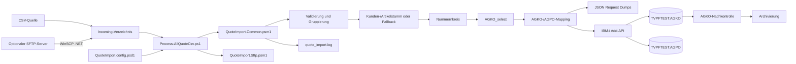
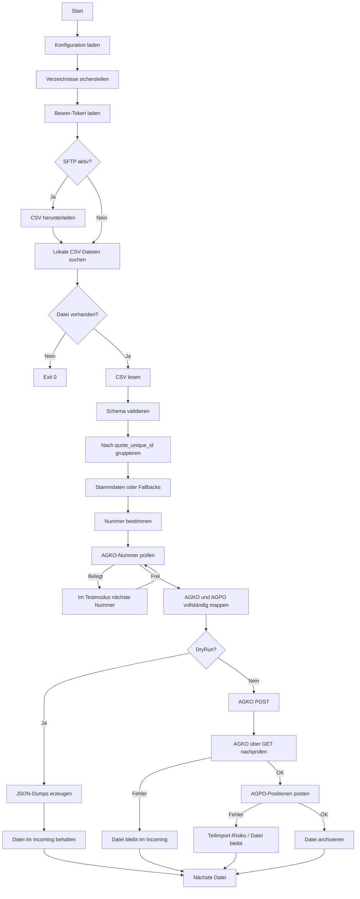
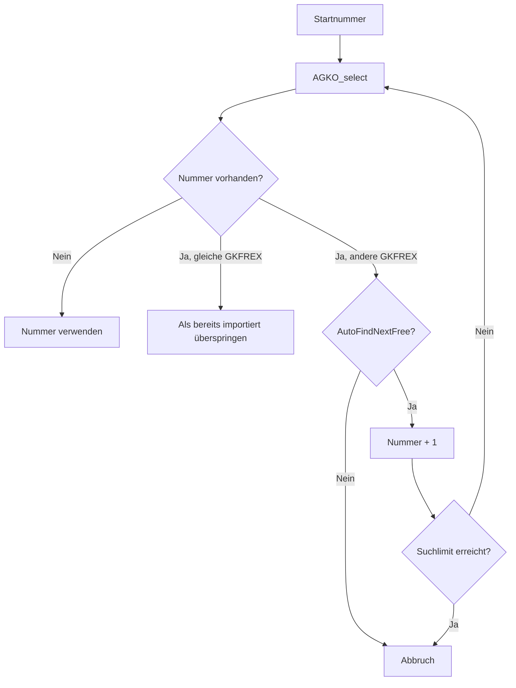
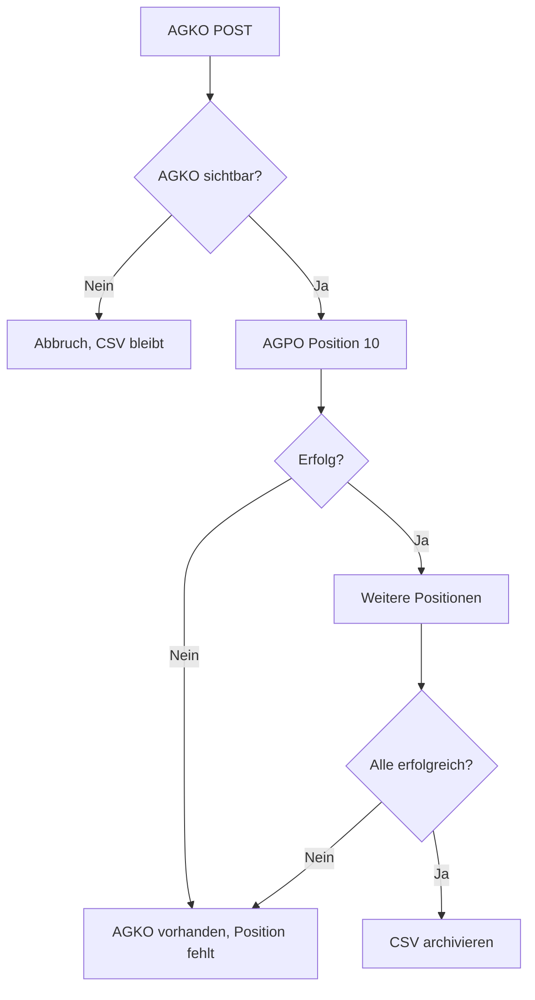

# Technische Gesamtdokumentation
## Automatisierter Angebotsimport CSV → Trend-ERP AGKO/AGPO

**Projekt:** Quotation Import  
**Version:** 13  
**Technologie:** Windows PowerShell 5.1, HTTP/JSON, IBM i / DB2 for i, optional WinSCP .NET  
**Projektpfad:** `D:\Quotation`  
**Laufzeitpfad:** `D:\Quotation\QuoteImport`  
**Aktive Testtabellen:** `TVPFTEST.AGKO`, `TVPFTEST.AGPO`  
**Stand:** 22.07.2026

---

## 1. Ziel und Zweck

Die Lösung übernimmt Angebotsdaten aus einer semikolongetrennten CSV-Datei und überträgt sie über HTTP/JSON in die Trend-ERP-Tabellen:

- `AGKO` für den Angebotskopf,
- `AGPO` für die Angebotspositionen.

Alle Zeilen mit derselben `quote_unique_id` bilden eine Angebotsgruppe.

Das System übernimmt:

- CSV-Eingang,
- Schema- und Inhaltsvalidierung,
- Gruppierung,
- Kunden- und Artikelstamm-Fallbacks,
- Nummernvergabe,
- AGKO-/AGPO-Mapping,
- technische Vorbelegung,
- JSON-Dumps,
- API-Aufrufe,
- AGKO-Nachkontrolle,
- Archivierung erfolgreicher Dateien,
- Protokollierung und Exit-Codes.

---

## 2. Aktuell bestätigter Funktionsstand

Folgende Punkte wurden praktisch bestätigt:

1. Bearer-Token kann interaktiv und aus einer DPAPI-geschützten Datei gelesen werden.
2. `AGKO_select` ist mit `GKAGJJ` und `GKAGNR` erreichbar.
3. `data: []` bedeutet kein Treffer.
4. Der Add-Service akzeptiert AGKO- und AGPO-Payloads.
5. `testMode=true` führt ausdrücklich zu keinem INSERT.
6. `testMode=false` führt einen echten INSERT in die angegebene Testtabelle aus.
7. AGKO-Datensätze wurden erfolgreich in `TVPFTEST.AGKO` angelegt.
8. AGPO-Datensätze wurden erfolgreich in `TVPFTEST.AGPO` angelegt.
9. Eine bereits belegte Nummer wird erkannt.
10. Ab Version 13 kann im Testbetrieb automatisch die nächste freie Nummer gesucht werden.
11. Technische Vorbelegungen können für Kopf und Position synchron erzeugt werden.
12. Statische Zusatzfelder sind über die Konfiguration erweiterbar.

---

## 3. Systemarchitektur



---

## 4. Verzeichnisstruktur

```text
D:\Quotation\
├── Process-AllQuoteCsv.ps1
├── Send-QuoteCsv.ps1
├── Download-QuoteCsvFromSftp.ps1
├── QuoteImport.Common.psm1
├── QuoteImport.Sftp.psm1
├── QuoteImport.config.psd1
├── Test-AGKOSelect.ps1
├── README.md
├── sample-quotes.csv
└── QuoteImport\
    ├── incoming\
    ├── archive\
    ├── logs\
    │   ├── quote_import.log
    │   └── winscp-session.log
    ├── request-dumps\
    └── secure\
        ├── api-token.sec
        └── sftp-password.sec
```

---

## 5. Komponenten

| Datei | Aufgabe |
|---|---|
| `Process-AllQuoteCsv.ps1` | Gesamtsteuerung aller CSV-Dateien |
| `Send-QuoteCsv.ps1` | Einzeldatei-Test und Einzelimport |
| `Download-QuoteCsvFromSftp.ps1` | Manueller SFTP-Download |
| `QuoteImport.Common.psm1` | Validierung, Mapping, API, Nummernkreis, Logging |
| `QuoteImport.Sftp.psm1` | SFTP-Verbindung, Download, Remote-Löschung |
| `QuoteImport.config.psd1` | Zentrale Konfiguration |
| `Test-AGKOSelect.ps1` | Direkter Test des bestätigten AGKO-GET-Service |
| `sample-quotes.csv` | Beispiel- und Testdatei |

---

## 6. Batch-Ablauf



---

## 7. Startbefehle

### 7.1 Dry-Run

```powershell
Set-Location 'D:\Quotation'
.\Process-AllQuoteCsv.ps1
```

Ergebnis:

```text
Execute=False
DryRun=True
```

### 7.2 Echter Testtabellen-Import

```powershell
Set-Location 'D:\Quotation'
.\Process-AllQuoteCsv.ps1 -Execute
```

Ergebnis:

```text
Execute=True
DryRun=False
Api.TestMode=False
HeaderTable=TVPFTEST.AGKO
PositionTable=TVPFTEST.AGPO
```

### 7.3 Interaktiver Bearer-Token

```powershell
.\Process-AllQuoteCsv.ps1 `
    -Execute `
    -PromptForBearerToken
```

### 7.4 Einzelne Datei

```powershell
.\Send-QuoteCsv.ps1 `
    -CsvPath 'D:\Quotation\QuoteImport\incoming\sample-quotes.csv'
```

### 7.5 AGKO-Select testen

```powershell
.\Test-AGKOSelect.ps1 `
    -Year 2026 `
    -QuoteNumber '103016'
```

---

## 8. CSV-Format

### 8.1 Spalten

```text
quote_unique_id
quote_number
customer_number
article_number
quantity
quote_date
delivery_company_name1
delivery_company_name2
delivery_company_name3
delivery_address
delivery_address_misc
delivery_zip_code
delivery_city
delivery_country
delivery_email
delivery_phone
field_sales_id
reference_2
valid_from
valid_to
discount
gross_unit_price
net_unit_price
```

### 8.2 Beispiel

```csv
quote_unique_id;quote_number;customer_number;article_number;quantity;quote_date;delivery_company_name1;delivery_company_name2;delivery_company_name3;delivery_address;delivery_address_misc;delivery_zip_code;delivery_city;delivery_country;delivery_email;delivery_phone;field_sales_id;reference_2;valid_from;valid_to;discount;gross_unit_price;net_unit_price
63a6c555;WVO-gyEmRyn8;255521;4450017346;3.00;08.07.2026;Caravan Elements DALCHOW;;;Beunstraße 29;Matthias Dalchow;61169;Friedberg (Hessen);DE;;;TEST;;06.07.2026;10.07.2026;;203.01;203.01
```

---

## 9. Validierung

| Prüfung | Regel |
|---|---|
| Dateiinhalt | mindestens eine Datenzeile |
| CSV-Schema | alle erwarteten Spalten vorhanden |
| `quote_unique_id` | Pflicht, max. 20 Zeichen |
| Kopfkonsistenz | definierte Kopfwerte innerhalb der Gruppe identisch |
| `article_number` | Pflicht, max. 15 Zeichen |
| `quantity` | numerisch und > 0 |
| `discount` | leer = 0, sonst 0–100 |
| Preise | mindestens Brutto oder Netto |
| Datum | unterstütztes Format |
| Gültigkeit | `valid_to >= valid_from` |
| Sachbearbeiter | maximal 3 Zeichen, sonst Default |

Unterstützte Datumsformate:

```text
dd.MM.yyyy
yyyy-MM-dd
yyyyMMdd
```

---

## 10. API-Konfiguration

```powershell
Api = @{
    BaseUrl = 'http://localhost:8085/api/ibmi/s105dd7a'

    HeaderSelectUrl =
        'http://az16emsapp01.dometic.internal:8085/api/services/AGKO_select'

    ExternalReferenceSelectUrl = ''
    SqlSelectUrl = ''
    AddUrl = ''

    HeaderTable = 'TVPFTEST.AGKO'
    PositionTable = 'TVPFTEST.AGPO'

    TestMode = $false
    TimeoutSeconds = 90

    VerifyHeaderAfterInsert = $true
    WriteVerificationAttempts = 3
    WriteVerificationDelayMilliseconds = 500

    BearerTokenFile =
        'D:\Quotation\QuoteImport\secure\api-token.sec'

    PromptForBearerToken = $false
}
```

---

## 11. Bestätigter AGKO-Select

### 11.1 Anfrage

```http
GET /api/services/AGKO_select?GKAGJJ=2026&GKAGNR=103016
Authorization: Bearer <Token>
Accept: application/json
```

### 11.2 Treffer

```json
{
  "success": true,
  "data": [
    {
      "GKAGJJ": "2026",
      "GKAGNR": "103016",
      "GKFREX": "63a6c523",
      "GKKDNR": "255521"
    }
  ]
}
```

### 11.3 Kein Treffer

```json
{
  "success": true,
  "data": []
}
```

### 11.4 Einschränkung

Der Service unterstützt nur:

```text
GKAGJJ
GKAGNR
```

Eine direkte Abfrage nach `GKFREX` ist aktuell nicht bestätigt.

---

## 12. Add-API

### 12.1 AGKO-Request

```json
{
  "table": "TVPFTEST.AGKO",
  "testMode": false,
  "data": {
    "GKFIRM": "01",
    "GKAGJJ": 2026,
    "GKAGNR": "103017",
    "GKFREX": "63a6c555"
  }
}
```

### 12.2 AGPO-Request

```json
{
  "table": "TVPFTEST.AGPO",
  "testMode": false,
  "data": {
    "GPFIRM": "01",
    "GPAGJJ": 2026,
    "GPAGNR": "103017",
    "GPAGPO": 10
  }
}
```

### 12.3 API-Testmodus

Bestätigte Antwort:

```json
{
  "STATUS": "OK",
  "MESSAGE": "Test mode active, nothing inserted."
}
```

Diese Antwort darf nicht als erfolgreicher Import gelten.

---

## 13. AGKO-Mapping

| Feld | Quelle / Regel |
|---|---|
| `GKFIRM` | `Defaults.Company` |
| `GKAGAR` | `Defaults.DocumentType` |
| `GKAGJJ` | Nummernkreis-Jahr |
| `GKAGNN` | numerische Angebotsnummer |
| `GKAGNR` | sechsstellige Angebotsnummer |
| `GKKDNR` | `customer_number` |
| `GKSABE` | `field_sales_id` oder Default |
| `GKWKNR` | `Defaults.Plant` |
| `GKABTL` | `Defaults.Department` |
| `GKABAR` | `Defaults.OutputType` |
| `GKWACD` | Kundenstamm/Fallback |
| `GKAGST` | `Defaults.Status` |
| `GKGADA` | `valid_from` |
| `GKGBDA` | `valid_to` |
| `GKAGDA` | `quote_date` |
| `GKARF1` | `quote_number` |
| `GKARF2` | `reference_2` |
| `GKVSBD` | Versandbedingung |
| `GKLIBD` | Lieferbedingung |
| `GKZABD` | Zahlungsbedingung |
| `GKSPCD` | Sprache |
| `GKWVDA` | `0` |
| `GKKOND` | `J` |
| `GKTLKZ` | `N` |
| `GKFREX` | `quote_unique_id` |

### 13.1 Technische AGKO-Felder

| Feld | Wert |
|---|---|
| `GKJNAM` | `APICAL` |
| `GKJDAT` | aktuelles Datum `yyyyMMdd` |
| `GKJZEI` | aktuelle Uhrzeit `HHmmss` |
| `GKUSER` | `DILA` |
| `GKPROG` | `TRAGKO` |
| `GKBIBL` | `TVPP1` |

---

## 14. AGPO-Mapping

| Feld | Quelle / Regel |
|---|---|
| `GPFIRM` | AGKO |
| `GPKDNR` | AGKO |
| `GPAGJJ` | AGKO |
| `GPAGNR` | AGKO |
| `GPAGPO` | 10, 20, 30 ... |
| `GPAGAR` | AGKO |
| `GPWKNR` | AGKO |
| `GPABTL` | AGKO |
| `GPSABE` | AGKO |
| `GPABAR` | AGKO |
| `GPWACD` | AGKO |
| `GPAGST` | AGKO |
| `GPGADA` | AGKO |
| `GPGBDA` | AGKO |
| `GPTENR` | `article_number` |
| `GPMENG` | `quantity` |
| `GPTBZ1` | Artikelstamm/Fallback |
| `GPTBZ2` | Artikelstamm/Fallback |
| `GPMEIN` | Mengeneinheit |
| `GPMEPR` | Preiseinheit |
| `GPWAWT` | Menge × Bruttopreis |
| `GPKURS` | `0` |
| `GPPRAR` | `AKD` |
| `GPPREI` | Bruttopreis |
| `GPNESU` | Menge × Nettopreis |
| `GPPDIM` | `1` |
| `GPKON1` | `RA5` |
| `GPKOW1` | Rabatt |
| `GPPRZ1` | `J` |
| `GPAGDA` | Angebotsdatum |
| `GPURPR` | Bruttopreis |

### 14.1 Technische AGPO-Felder

| Feld | Wert |
|---|---|
| `GPJNAM` | `APICAL` |
| `GPJDAT` | gleiches Datum wie AGKO |
| `GPJZEI` | gleiche Uhrzeit wie AGKO |
| `GPUSER` | `DILA` |
| `GPPROG` | `TRAGPO` |
| `GPBIBL` | `TVPP` |
| `GPBOKZ` | `J` |
| `GPTXKZ` | `N` |
| `GPEMKZ` | `N` |
| `GPAFKZ` | `J` |
| `GPMWCD` | `16` |
| `GPLTKZ` | `N` |
| `GPGSKZ` | `J` |

---

## 15. Erweiterbare Vorbelegung

```powershell
Defaults = @{
    TechnicalRuntimeFields = @{
        Enabled   = $true
        JobName   = 'APICAL'
        User      = 'DILA'
        DateMode  = 'Current'
        FixedDate = '20260722'
        TimeMode  = 'Current'
        FixedTime = '155924'
    }

    AdditionalHeaderFields = @{
        GKPROG = 'TRAGKO'
        GKBIBL = 'TVPP1'
    }

    AdditionalPositionFields = @{
        GPPROG = 'TRAGPO'
        GPBIBL = 'TVPP'
        GPBOKZ = 'J'
        GPTXKZ = 'N'
        GPEMKZ = 'N'
        GPAFKZ = 'J'
        GPMWCD = '16'
        GPLTKZ = 'N'
        GPGSKZ = 'J'
    }
}
```

Schutzmechanismen:

- Kernfelder dürfen nicht überschrieben werden.
- Laufzeitfelder dürfen nicht doppelt definiert werden.
- Ungültige Feldnamen führen zum Abbruch.
- Nullwerte werden als leere Zeichenfolge übertragen.
- Jedes Zusatzfeld wird im DEBUG-Log ausgewiesen.

---

## 16. Preisberechnung

```text
Brutto leer:
Brutto = Netto

Netto leer:
Netto = Brutto × (1 - Rabatt / 100)

GPWAWT = Menge × Brutto
GPNESU = Menge × Netto
```

Rundung:

| Feld | Stellen |
|---|---:|
| `GPWAWT` | 2 |
| `GPNESU` | 2 |
| `GPPREI` | 3 |
| `GPURPR` | 2 |
| `GPKOW1` | 2 |

Rundungsmodus:

```text
MidpointRounding.AwayFromZero
```

---

## 17. Nummernkreis

### 17.1 Aktueller Testmodus

```powershell
NumberRange = @{
    Mode                   = 'Fixed'
    FixedYear              = 2026
    FixedStartNumber       = 103016
    AllowFixedInExecute    = $true
    AutoFindNextFree       = $true
    MaximumSearchAttempts  = 100
    Url                    = ''
    Method                 = 'POST'
}
```

### 17.2 Ablauf



### 17.3 Produktionsanforderung

Der Testmodus ist nicht atomar.

Für Produktion erforderlich:

```powershell
Mode = 'Api'
Url  = '<atomarer Nummernkreis-Endpunkt>'
```

Verboten:

```sql
SELECT MAX(GKAGNN) + 1
```

---

## 18. Idempotenz

Aktuelle direkte GKFREX-Prüfung:

```text
nicht verfügbar
```

Grund:

`AGKO_select` unterstützt nur `GKAGJJ` und `GKAGNR`.

Vorhandene Vorbereitung:

```powershell
ExternalReferenceSelectUrl = ''
```

Für vollständige Idempotenz wird ein separater Endpoint benötigt, der nach
`GKFIRM` und `GKFREX` suchen kann.

---

## 19. Stammdaten

### 19.1 Aktueller Modus

```powershell
MasterData.Strict = $false
CustomerQueryTemplate = ''
ArticleQueryTemplate = ''
SqlSelectUrl = ''
```

### 19.2 Kunden-Fallback

```powershell
CurrencyCode       = 'EUR'
ShippingCondition  = '220'
DeliveryCondition  = '060'
PaymentCondition   = '012'
LanguageCode       = 'D'
```

### 19.3 Artikel-Fallback

```powershell
Description1 = ''
Description2 = ''
QuantityUnit = 'S'
PriceUnit    = 'S'
```

### 19.4 Noch zu klären

- echte Kundenstammtabelle,
- echte Artikelstammtabelle,
- `GPTBZ1`,
- `GPTBZ2`,
- `GPPRGR`,
- `GPDIEK`,
- `GPDSKZ`.

---

## 20. Bearer-Token und DPAPI

### 20.1 Secret erstellen

```powershell
$path = 'D:\Quotation\QuoteImport\secure\api-token.sec'

$secureToken = Read-Host `
    'API Bearer Token eingeben' `
    -AsSecureString

$encryptedToken = ConvertFrom-SecureString `
    -SecureString $secureToken

$utf8WithoutBom = New-Object `
    System.Text.UTF8Encoding($false)

[System.IO.File]::WriteAllText(
    $path,
    $encryptedToken,
    $utf8WithoutBom
)
```

### 20.2 Test ohne interaktive Eingabe

```powershell
.\Test-AGKOSelect.ps1 `
    -Year 2026 `
    -QuoteNumber 100004
```

### 20.3 Scheduler-Bedingung

Secret-Datei erzeugen:

- auf demselben Server,
- unter demselben Benutzer,
- unter demselben Benutzerprofil,
- unter dem späteren Task-Scheduler-Konto.

---

## 21. Write-Verification

Nach AGKO-POST:

1. bis zu drei GET-Versuche,
2. Wartezeit 500 ms,
3. exakte Prüfung von Jahr und Nummer,
4. optionale Plausibilisierung von GKFREX und Kunde.

Erst danach werden AGPO-Positionen gesendet.

Bekannte Lücke:

AGPO wird aktuell nicht über einen bestätigten Select-Service nachkontrolliert.

---

## 22. Fehler- und Teilimportverhalten



Wichtig:

Es gibt keine bestätigte automatische Rücknahme eines bereits angelegten
AGKO-Satzes.

Bei Fehlern nach dem Kopf-INSERT kann ein Teilimport entstehen.

---

## 23. SFTP

Aktuell:

```powershell
Sftp.Enabled = $false
```

Bei Aktivierung erforderlich:

- Host,
- Port,
- Benutzer,
- Passwortdatei oder Private Key,
- Remote-Verzeichnis,
- Dateimaske,
- WinSCPnet.dll,
- echter SSH-Fingerprint.

Sicherheitsregeln:

- Host-Key-Prüfung niemals stillschweigend deaktivieren.
- Remote-Datei erst nach vollständig erfolgreichem Import löschen.
- Bei Fehler lokal und remote behalten.
- Keine parallele Verarbeitung derselben Datei.

---

## 24. Windows Task Scheduler

### 24.1 Programm

```text
powershell.exe
```

### 24.2 Argumente

```text
-NoProfile -ExecutionPolicy Bypass -File "D:\Quotation\Process-AllQuoteCsv.ps1" -Execute
```

### 24.3 Starten in

```text
D:\Quotation
```

### 24.4 Empfohlene Einstellungen

- unabhängig von Benutzeranmeldung ausführen,
- Kennwort speichern,
- keine zweite Instanz parallel starten,
- Fehlercode auswerten,
- Wiederholungen begrenzen,
- Laufzeit überwachen.

### 24.5 Exit-Codes

| Code | Bedeutung |
|---:|---|
| 0 | erfolgreich oder keine Datei |
| 1 | mindestens eine Datei fehlgeschlagen |
| 2 | SFTP-Download fehlgeschlagen |

---

## 25. Betriebshandbuch

### 25.1 Vor jedem Test

```powershell
$config = Import-PowerShellDataFile `
    'D:\Quotation\QuoteImport.config.psd1'

$config.Api
$config.NumberRange
$config.Defaults.TechnicalRuntimeFields
```

Prüfen:

```text
HeaderTable = TVPFTEST.AGKO
PositionTable = TVPFTEST.AGPO
TestMode = False
AllowFixedInExecute = True
AutoFindNextFree = True
```

### 25.2 Modulstand prüfen

```powershell
Select-String `
    -Path 'D:\Quotation\QuoteImport.Common.psm1' `
    -Pattern 'AutoFindNextFree|TechnicalRuntimeFields|Confirm-QuoteHeaderInserted'
```

### 25.3 Dry-Run

```powershell
.\Process-AllQuoteCsv.ps1
```

### 25.4 Execute

```powershell
.\Process-AllQuoteCsv.ps1 -Execute
```

### 25.5 Log verfolgen

```powershell
Get-Content `
    'D:\Quotation\QuoteImport\logs\quote_import.log' `
    -Tail 100 `
    -Wait
```

---

## 26. SQL-Prüfungen

### 26.1 AGKO

```sql
SELECT *
FROM TVPFTEST.AGKO
WHERE GKAGJJ = 2026
  AND GKAGNR = '103017';
```

### 26.2 AGPO

```sql
SELECT *
FROM TVPFTEST.AGPO
WHERE GPAGJJ = 2026
  AND GPAGNR = '103017'
ORDER BY GPAGPO;
```

### 26.3 Externe Referenz

```sql
SELECT
    GKAGJJ,
    GKAGNR,
    GKFREX,
    GKKDNR,
    GKARF1
FROM TVPFTEST.AGKO
WHERE GKFREX = '63a6c555';
```

Diese SQL-Abfrage ist eine direkte Datenbankprüfung und nicht der aktuell
verfügbare HTTP-Select-Service.

---

## 27. Positiver Testplan

| Test | Erwartung |
|---|---|
| Dry-Run mit gültiger CSV | JSON-Dumps, kein INSERT |
| Execute mit freier Nummer | AGKO und AGPO vorhanden |
| Startnummer belegt | nächste freie Nummer wird gesucht |
| mehrere Positionen | 10, 20, 30 ... |
| langer `field_sales_id` | Warnung und Default `TIK` |
| Brutto leer | Brutto aus Netto |
| Netto leer | Netto aus Brutto und Rabatt |
| Current-Zeitmodus | aktuelles Datum/Uhrzeit in AGKO und AGPO |
| Fixed-Zeitmodus | feste Werte in AGKO und AGPO |
| Secret-Datei | kein Prompt im Scheduler |

---

## 28. Negativer Testplan

| Test | Erwartung |
|---|---|
| leere CSV | Abbruch |
| fehlende Spalte | Abbruch |
| leere `quote_unique_id` | Abbruch |
| ID länger als 20 Zeichen | Abbruch |
| Artikelnummer leer | Abbruch |
| Menge 0 oder negativ | Abbruch |
| Rabatt > 100 | Abbruch |
| beide Preise leer | Abbruch |
| `valid_to < valid_from` | Abbruch |
| unterschiedliche Kopfwerte | Abbruch |
| Add-API meldet `nothing inserted` | Fehler |
| AGKO nach POST nicht sichtbar | Fehler |
| mehrfache exakte AGKO-Treffer | Fehler |
| Suchlimit erreicht | Fehler |
| Zieltabellen nicht `TVPFTEST.*` bei Fixed Execute | Sicherheitsabbruch |
| ungültige Zusatzfeldnamen | Abbruch |
| Zusatzfeld überschreibt Kernfeld | Abbruch |
| Secret unter falschem Benutzer | Entschlüsselungsfehler |

---

## 29. Troubleshooting

### 29.1 `Input string was not in a correct format`

Prüfen:

```powershell
(Get-Content `
    'D:\Quotation\QuoteImport\secure\api-token.sec' `
    -Raw).Trim().Length
```

Secret gegebenenfalls unter dem richtigen Benutzer neu erzeugen.

### 29.2 SQLSTATE 07002

Ursache:

Falsche Parameter für `AGKO_select`.

Nur verwenden:

```text
GKAGJJ
GKAGNR
```

### 29.3 `data=[]` wird als Treffer behandelt

Das Common-Modul muss die Existenz des Envelope-Feldes separat prüfen und bei
leerem Array exakt null Zeilen zurückgeben.

### 29.4 `Test mode active, nothing inserted`

```powershell
Api.TestMode = $false
```

Nur bei ausdrücklich gesetzten Testtabellen.

### 29.5 Alte Modulversion wird geladen

```powershell
Remove-Module QuoteImport.Common `
    -Force `
    -ErrorAction SilentlyContinue

Import-Module `
    'D:\Quotation\QuoteImport.Common.psm1' `
    -Force `
    -DisableNameChecking
```

Am sichersten neues PowerShell-Fenster öffnen.

### 29.6 Nummer bereits belegt

Bei v13 und:

```powershell
AutoFindNextFree = $true
```

muss die Suche automatisch mit der nächsten Nummer fortfahren.

---

## 30. Sicherheit

- Secrets nur DPAPI-geschützt.
- NTFS-Zugriff auf `secure`, Logs und Dumps einschränken.
- Token niemals loggen.
- API-Antworten können personenbezogene Daten enthalten.
- Keine Produktivtabellen ohne Freigabe aktivieren.
- Kein `MAX + 1`.
- Keine parallelen Testläufe.
- Keine automatische Löschung fehlerhafter Dateien.
- Keine nicht bestätigten Rollbacks.
- Keine unbekannten Feldzuordnungen.

---

## 31. Produktionsfreigabe-Checkliste

### Technisch

- [ ] Produktive Add-URL bestätigt
- [ ] Produktive Tabellen bestätigt
- [ ] atomarer Nummernkreis-Service vorhanden
- [ ] GKFREX-Select-Service vorhanden
- [ ] Kundenstammabfrage bestätigt
- [ ] Artikelstammabfrage bestätigt
- [ ] AGPO-Nachkontrolle vorhanden
- [ ] Teilimport-/Rollback-Konzept beschlossen
- [ ] Scheduler-Benutzer eingerichtet
- [ ] DPAPI-Secrets unter Scheduler-Benutzer erstellt
- [ ] SFTP-Host-Key bestätigt
- [ ] Logrotation eingerichtet
- [ ] Monitoring und Alarmierung eingerichtet

### Fachlich

- [ ] AGKO-Feldmapping freigegeben
- [ ] AGPO-Feldmapping freigegeben
- [ ] Preislogik freigegeben
- [ ] Rabattlogik freigegeben
- [ ] Versand-/Liefer-/Zahlungsbedingungen bestätigt
- [ ] Sachbearbeiterlogik bestätigt
- [ ] `GPDSKZ` geklärt
- [ ] `GPPRGR` geklärt
- [ ] `GPDIEK` geklärt
- [ ] Lieferadressverarbeitung geklärt
- [ ] Trend-Folgeprozesse getestet

---

## 32. Bekannte Restrisiken

1. **Teilimport:** AGKO kann vorhanden sein, obwohl AGPO teilweise fehlt.
2. **Nicht atomare Testnummer:** Parallelität kann zu Kollisionen führen.
3. **GKFREX-Suche fehlt:** vollständige Idempotenz ist noch nicht gegeben.
4. **Fallback-Stammdaten:** fachliche Werte können unvollständig sein.
5. **Direktes Tabellenschreiben:** Trend-Folgeprozesse müssen gesondert geprüft werden.
6. **AGPO-Nachkontrolle fehlt:** API-Erfolg ist derzeit die einzige Positionsbestätigung.
7. **Lieferadresse:** CSV-Felder sind noch keiner bestätigten Trend-Struktur zugeordnet.

---

## 33. Empfohlene nächste Entwicklungsschritte

1. Atomaren Nummernkreis-Service bereitstellen.
2. `GKFREX`-Lookup-Service bereitstellen.
3. Kundenstamm-Query anbinden.
4. Artikelstamm-Query anbinden.
5. AGPO-Select und Positionsnachkontrolle ergänzen.
6. Transaktionskonzept für Kopf und Positionen definieren.
7. Quarantäneverzeichnis für fehlerhafte Dateien ergänzen.
8. Logrotation und Monitoring ergänzen.
9. Scheduler ohne parallele Instanzen einrichten.
10. Produktiven End-to-End-Test mit Trend-Fachbereich durchführen.
