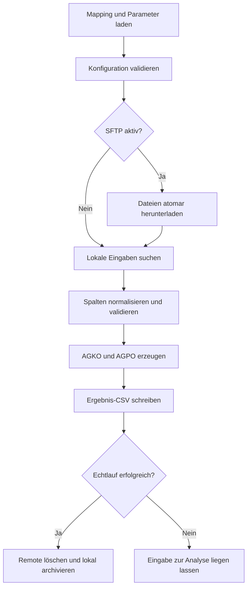

# Betriebs- und Mappingdokumentation

## 1. Ziel und Ablauf

Der Prozess lädt optional Dateien per SFTP, sucht lokal nach der in der Mappingdatei definierten Eingabemaske, normalisiert die externen Spaltennamen auf ein stabiles internes Schema, validiert die Daten und erzeugt AGKO-/AGPO-Payloads. Nach einem erfolgreichen Echtlauf wird die Eingabedatei archiviert. Für jeden Lauf entsteht außerdem eine Ergebnis-CSV.



## 2. Klare Zuständigkeiten

| Datei | Enthält | Darf nicht enthalten |
|---|---|---|
| `QuoteImport.settings.psd1` | Pfade, API, SFTP, Nummernkreis, Defaults, Softwareabhängigkeiten | Lieferantenspalten und Ausgabedateinamen |
| `QuoteImport.mapping.psd1` | Eingabemaske, CSV-Format, Spaltenzuordnung, Zieltabellen, Namensvorlagen | Kennwörter, Tokens und Host-Zugangsdaten |
| `QuoteImport.Common.psm1` | allgemeine Transformation, Validierung und API-Verarbeitung | umgebungsspezifische Pfade |
| `QuoteImport.Sftp.psm1` | WinSCP-Verbindung, Download und Remote-Löschung | feste Dateimaske |
| `Start-QuoteImport.ps1` | Orchestrierung und Exitcodes | fachliche Feldzuordnung |

## 3. Eingabemapping

`Input.FileMask` bestimmt sowohl die SFTP-Auswahl als auch die lokal zu verarbeitenden Dateien. `Delimiter` muss genau ein Zeichen enthalten. `Encoding` verwendet einen von Windows PowerShell 5.1 unterstützten Wert, normalerweise `UTF8`.

Im Abschnitt `Input.Columns` steht links der interne Pflichtname und rechts der tatsächliche Spaltenname des Lieferanten:

```powershell
Columns = @{
    quote_unique_id = 'external_quote_id'
    customer_number = 'customer_no'
    article_number  = 'sku'
    # weitere Pflichtfelder ...
}
```

Die interne Logik bleibt dadurch unverändert. Alle 23 Pflichtfelder müssen genau einmal gemappt sein. Fehlende Quellspalten stoppen die Datei vor einem API-Aufruf.

## 4. Ausgabemapping

| Schlüssel | Bedeutung | erlaubte Platzhalter |
|---|---|---|
| `HeaderTable` | API-Zieltabelle für Angebotskopf | keine; Format `LIBRARY.TABLE` |
| `PositionTable` | API-Zieltabelle für Positionen | keine; Format `LIBRARY.TABLE` |
| `ArchiveFileName` | Name nach erfolgreichem Echtlauf | `{BaseName}`, `{Timestamp}`, `{Extension}` |
| `ResultFileName` | Detailstatus je Eingabedatei | `{BaseName}`, `{Timestamp}`, `{Extension}` |
| `HeaderDumpFileName` | JSON-Dump des AGKO-Requests | `{ExternalId}`, `{TrendYear}`, `{TrendNumber}` |
| `PositionDumpFileName` | JSON-Dump des AGPO-Requests | zusätzlich `{Position}` |

Unbekannte oder nicht ersetzte Platzhalter führen bewusst zu einem Fehler. Eine Vorlage darf keinen Verzeichnispfad erzeugen.

## 5. Parameter und Abhängigkeiten

Die einzige technische Parameterdatei ist `QuoteImport.settings.psd1`.

- `Dependencies`: Mindestversion PowerShell, WinSCP-DLL und erforderliche Module.
- `Paths`: Eingang, Archiv, Ergebnisse, Hauptlog und Request-Dumps.
- `Api`: Endpunkte, Timeout, Testmodus, Schreibprüfung und Token-Datei.
- `Defaults`: fachlich bestätigte AGKO-/AGPO-Vorbelegungen.
- `NumberRange`: Testnummer oder produktive atomare Reservierung.
- `MasterData`: Kunden-/Artikelabfragen und kontrollierte Fallbacks.
- `Sftp`: Host, Benutzer, Secret-Datei, Remote-Verzeichnis und Host-Key-Prüfung.

Geheimnisse gehören nicht in PSD1-Dateien. `BearerTokenFile` und `PasswordFile` verweisen auf mit `ConvertFrom-SecureString` erzeugte Dateien. Diese sind an Windows-Benutzer und Rechner gebunden.

## 6. Sicherheits- und Konsistenzregeln

- Standard ist Dry-Run; erst `-Execute` schreibt in die API.
- `AllowInsecureHostKey` bleibt `$false`; der echte SSH-Fingerprint ist einzutragen.
- Eine Remote-Datei wird nur nach vollständig erfolgreichem Import gelöscht.
- Eine fehlerhafte lokale Datei bleibt im Eingang liegen.
- API-Token und SFTP-Passwort werden nicht protokolliert.
- `HeaderTable` und `PositionTable` werden als qualifizierte IBM-i-Namen validiert.
- AGKO und AGPO sind getrennte Requests. Ohne serverseitige Transaktion kann bei einem späteren Positionsfehler ein Teilimport bestehen bleiben.

## 7. Exitcodes

| Code | Bedeutung |
|---:|---|
| `0` | keine Eingabe oder alle Dateien erfolgreich |
| `1` | mindestens eine lokale Datei bzw. Angebotsgruppe fehlgeschlagen |
| PowerShell-Fehler | Konfiguration, Mapping oder Abhängigkeit bereits beim Start ungültig |

## 8. Empfohlene Inbetriebnahme

1. Projektstrukturtest ausführen.
2. Beispieldatei in das Eingangsverzeichnis kopieren.
3. Dry-Run mit `-SkipSftp` ausführen und Log, Ergebnis-CSV und JSON-Dumps prüfen.
4. Zieltabellen und Feldlängen mit IBM i verifizieren.
5. SFTP aktivieren und Download separat testen.
6. Kontrollierten Echtlauf ausschließlich gegen Testtabellen durchführen.
7. Vor Produktion Nummernkreis auf atomare API-Reservierung umstellen.

## 9. Testfälle

| Test | Erwartung |
|---|---|
| Keine passende Datei | Exit 0, INFO-Eintrag, kein Fehler |
| Quellspalte umbenannt und Mapping angepasst | erfolgreiche Normalisierung |
| Pflichtspalte fehlt | Abbruch vor API-Aufruf |
| Ungültiges Datum/Menge/Preis | betroffene Angebotsgruppe `Failed` |
| Dry-Run | Dumps/Ergebnis vorhanden, keine API-Schreiboperation, keine Archivierung |
| Erfolgreicher Echtlauf | Ergebnis geschrieben, Remote-Datei gelöscht, lokal archiviert |
| API-Positionsfehler | Datei bleibt liegen; Log warnt vor möglichem Teilimport |
| Falscher SSH-Fingerprint | Verbindungsabbruch |

## 10. Scheduler-Aufruf

Programm: `powershell.exe`

Argumente für einen Echtlauf:

```text
-NoProfile -ExecutionPolicy Bypass -File "D:\Quotation\QuoteImport\scripts\Start-QuoteImport.ps1" -Execute
```

Das Scheduler-Konto muss dasselbe Konto sein, mit dem die Secret-Dateien erzeugt wurden, und Schreibrechte auf alle unter `Paths` konfigurierten Ziele besitzen.
